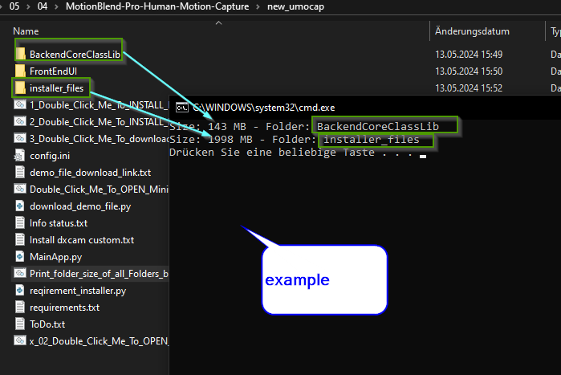
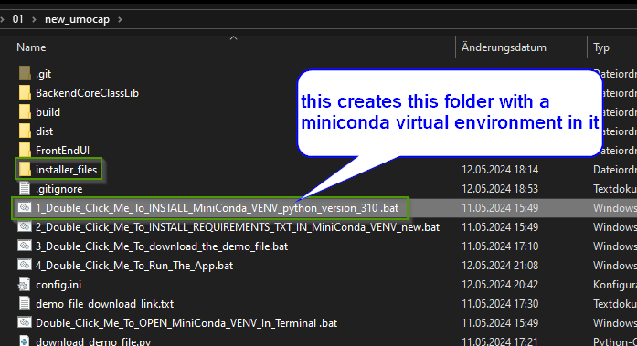
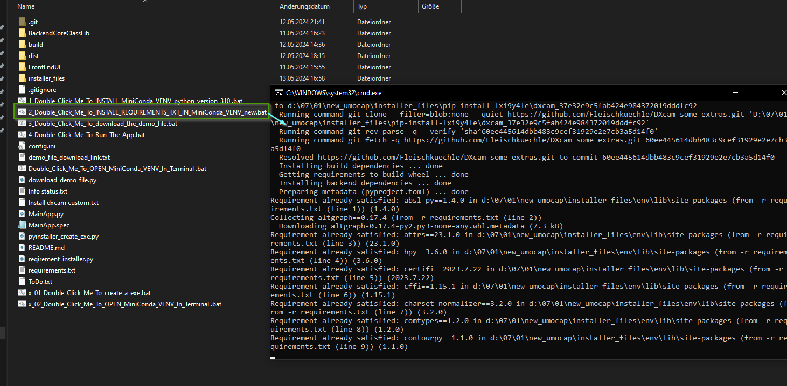
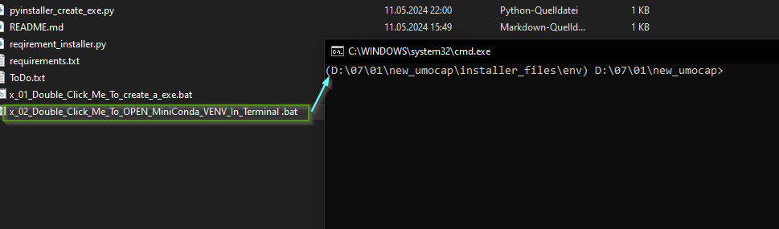

# Win_utils
this contains couple of .bat files to do annoying tasks in windows

place it in a folder from where you want the folder sizes , double click it and it opens a 
terminal and print each folder with size that is bigges as 1MB

5_Print_folder_size_of_all_Folders_bigger_as_1MB_Into_terminal.bat

1_Double_Click_Me_To_INSTALL_MiniConda_VENV_python_version_310 .bat

This installs a miniconda in the folder where its placed in and the doubleclick on it

2_Double_Click_Me_To_INSTALL_REQUIREMENTS_TXT_IN_MiniConda_VENV_new.bat

This installs all requirements in the with 1_Double_Click_Me_To_INSTALL_MiniConda_VENV_python_version_310 .bat
installed virtual environment  (there must be a text file with the requiremnts.txt in the same folder)

x_02_Double_Click_Me_To_OPEN_MiniConda_VENV_In_Terminal .bat

this opens the previous installed virtual environment in a terminal

