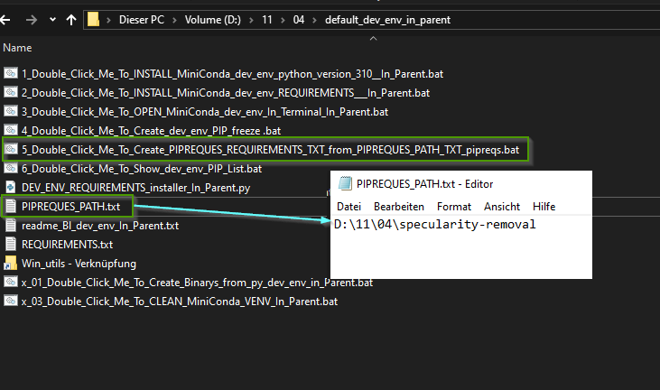
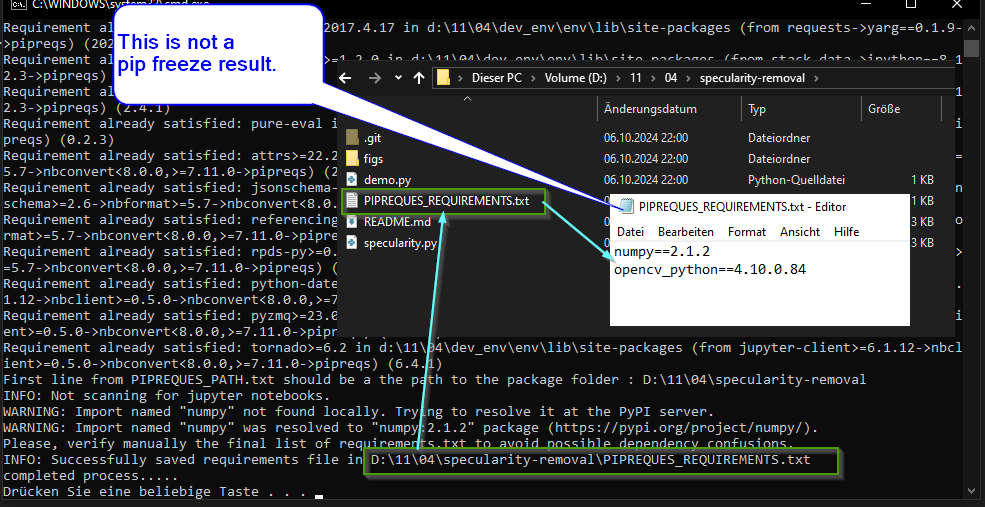
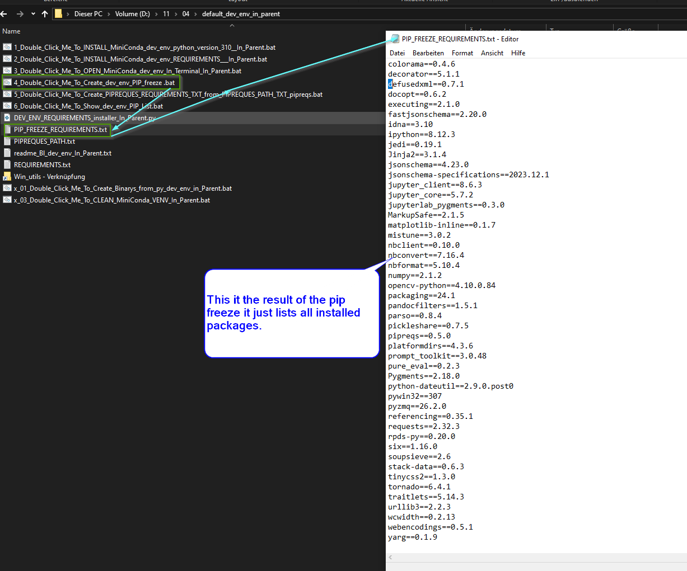

# Win_utils
this contains couple of .bat files to do annoying tasks in windows

place it in a folder from where you want the folder sizes , double click it and it opens a 
terminal and print each folder with size that is bigges as 1MB

5_Print_folder_size_of_all_Folders_bigger_as_1MB_Into_terminal.bat

1_Double_Click_Me_To_INSTALL_MiniConda_VENV_python_version_310 .bat

This installs a miniconda in the folder where its placed in and the doubleclick on it

2_Double_Click_Me_To_INSTALL_REQUIREMENTS_TXT_IN_MiniConda_VENV_new.bat

This installs all requirements in the with 1_Double_Click_Me_To_INSTALL_MiniConda_VENV_python_version_310 .bat
installed virtual environment  (there must be a text file with the requiremnts.txt in the same folder)

x_02_Double_Click_Me_To_OPEN_MiniConda_VENV_In_Terminal .bat

this opens the previous installed virtual environment in a terminal

TO get the requirements.txt that only shows the requirements of your project 
you can use 5_Double_Click_Me_To_Create_PIPREQUES_REQUIREMENTS_TXT_from_PIPREQUES_PATH_TXT_pipreqs.bat

this looks into this file where you put the path to your project in it
something like: D:\02\05\36\my_project_folder\
PIPREQUES_PATH.txt 

what is does:
it creates a text file called: PIPREQUES_REQUIREMENTS.txt
inside you project path from PIPREQUES_PATH.txt 
in this example you will find the file here:
D:\02\05\36\my_project_folder\PIPREQUES_REQUIREMENTS.txt

Here is an example:

A terminal window (we are on windows) will open and show this:

To understand: This is not a pip freeze result this only shows the dependencies you have in the 
project.

For comarision here is a pip freeze (created with 4_Double_Click_Me_To_Create_dev_env_PIP_freeze .bat):

